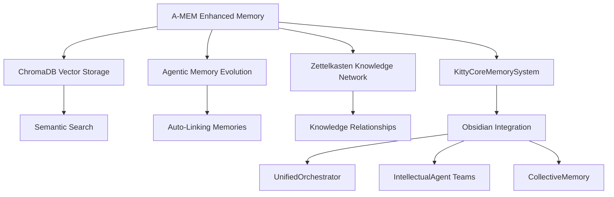
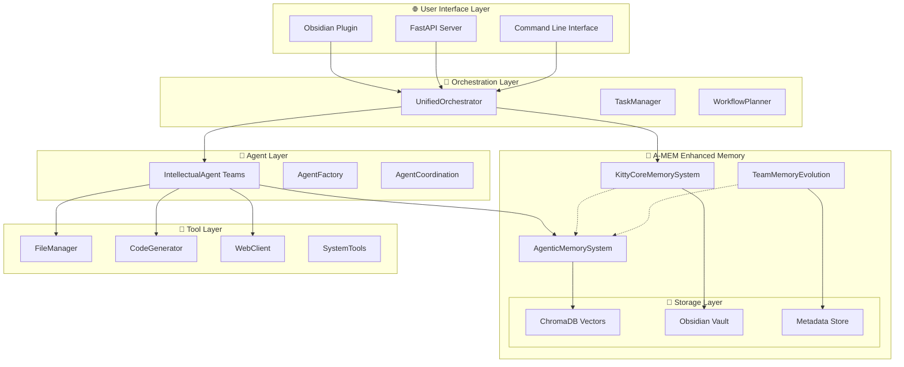

# 🏗️ KITTYCORE 3.0 + A-MEM - АРХИТЕКТУРА БУДУЩЕГО
## Революционная агентная система с эволюционирующей памятью

---

## 🎯 КОНЦЕПЦИЯ: "АГЕНТЫ + ЭВОЛЮЦИОНИРУЮЩАЯ ПАМЯТЬ"

**До A-MEM**: Агенты работали с примитивным TF-IDF поиском  
**После A-MEM**: Агенты обладают коллективным интеллектом с автоэволюцией знаний

---

## 🧠 ENHANCED MEMORY LAYER - ЯДРО СИСТЕМЫ



### 🔧 **Компоненты Enhanced Memory:**

#### 1. **AgenticMemorySystem** (A-MEM Core)
```python
class AgenticMemorySystem:
    """Профессиональная система агентной памяти"""
    
    def __init__(self):
        self.chromadb = ChromaClient()  # Векторная база
        self.embedding_model = "all-MiniLM-L6-v2"  # Semantic embeddings
        self.llm_backend = "openai"  # LLM для анализа
        self.evolution_engine = MemoryEvolution()  # Автоэволюция
        
    async def add_note(self, content: str) -> str:
        """Добавляет память с автоматической эволюцией"""
        # 1. Создание эмбеддинга через ChromaDB
        # 2. Поиск связанных воспоминаний  
        # 3. LLM анализ для создания контекста и тегов
        # 4. Автоматическое создание связей (Zettelkasten)
        # 5. Сохранение в ChromaDB + Obsidian vault
```

#### 2. **KittyCoreMemorySystem** (Wrapper)
```python
class KittyCoreMemorySystem:
    """Интеграция A-MEM в KittyCore 3.0"""
    
    def __init__(self, vault_path: str):
        self.amem = AgenticMemorySystem()
        self.vault_path = vault_path
        self.team_memories: Dict[str, List] = {}
        
    async def agent_remember(self, agent_id: str, memory: str, 
                           context: Dict[str, Any]) -> str:
        """Агент сохраняет воспоминание с коллективным обучением"""
        
    async def collective_search(self, query: str, 
                              team_id: str = None) -> List[Dict]:
        """Семантический поиск по коллективной памяти команды"""
        
    async def evolve_team_memory(self, team_id: str):
        """Эволюция коллективных знаний команды"""
```

#### 3. **TeamMemoryEvolution** (Collective Intelligence)
```python
class TeamMemoryEvolution:
    """Эволюция коллективной памяти команд агентов"""
    
    async def analyze_team_patterns(self, team_id: str) -> Dict[str, Any]:
        """Анализ паттернов работы команды через LLM"""
        
    async def create_meta_memories(self, patterns: Dict) -> str:
        """Создание мета-памяти команды"""
        
    async def suggest_optimizations(self, team_id: str) -> List[str]:
        """Предложения по улучшению работы команды"""
```

---

## 🚀 ИНТЕГРАЦИЯ С ОСНОВНЫМИ КОМПОНЕНТАМИ

### 🧭 **UnifiedOrchestrator + A-MEM**

```python
class UnifiedOrchestrator:
    """Главный дирижёр с революционной памятью"""
    
    def __init__(self):
        # Революционная замена старой памяти!
        self.enhanced_memory = KittyCoreMemorySystem(
            vault_path=self.obsidian_vault_path
        )
        self.memory_evolution = TeamMemoryEvolution()
        
    async def solve_task(self, task: str) -> Dict[str, Any]:
        """Решение задач с использованием коллективной памяти"""
        
        # 1. Поиск релевантного опыта семантически  
        relevant_experience = await self.enhanced_memory.collective_search(
            query=task,
            team_id=None  # поиск по всей системе
        )
        
        # 2. Создание контекста для агентов на основе опыта
        context = await self._build_smart_context(task, relevant_experience)
        
        # 3. Создание команды агентов с учётом опыта
        agents = await self._create_enhanced_agent_team(task, context)
        
        # 4. Выполнение с сохранением нового опыта
        results = await self._execute_with_memory_evolution(agents, task)
        
        # 5. Автоматическая эволюция коллективной памяти
        await self.memory_evolution.evolve_team_memory(agents[0].team_id)
        
        return results
        
    async def _build_smart_context(self, task: str, 
                                 experience: List[Dict]) -> str:
        """Создание умного контекста на основе релевантного опыта"""
        if not experience:
            return "Новая задача без предыдущего опыта."
            
        context_parts = [
            "📚 Релевантный опыт системы:",
            "=================="
        ]
        
        for exp in experience[:3]:  # топ-3 релевантных
            context_parts.extend([
                f"🎯 Задача: {exp.get('task', 'N/A')}",
                f"✅ Результат: {exp.get('result', 'N/A')}",
                f"🔗 Теги: {', '.join(exp.get('tags', []))}",
                "---"
            ])
            
        return "\n".join(context_parts)
```

### 🤖 **IntellectualAgent + Enhanced Memory**

```python
class IntellectualAgent:
    """Агент с революционной памятью и коллективным обучением"""
    
    def __init__(self, agent_id: str, team_id: str):
        self.agent_id = agent_id
        self.team_id = team_id
        self.enhanced_memory = None  # Инжектится оркестратором
        
    async def solve_subtask(self, subtask: str, context: str) -> Dict[str, Any]:
        """Решение подзадачи с использованием коллективной памяти"""
        
        # 1. Поиск релевантного опыта агента и команды
        personal_experience = await self.enhanced_memory.collective_search(
            query=subtask,
            team_id=self.agent_id  # личный опыт агента
        )
        
        team_experience = await self.enhanced_memory.collective_search(
            query=subtask,
            team_id=self.team_id  # опыт команды
        )
        
        # 2. Обогащение контекста опытом
        enhanced_context = await self._enrich_context_with_memory(
            context, personal_experience, team_experience
        )
        
        # 3. Выполнение с учётом накопленного опыта
        result = await self._execute_with_smart_context(subtask, enhanced_context)
        
        # 4. Сохранение нового опыта в коллективную память
        await self.enhanced_memory.agent_remember(
            agent_id=self.agent_id,
            memory=f"Задача: {subtask} | Результат: {result}",
            context={
                "team_id": self.team_id,
                "category": "subtask_execution",
                "success": result.get("success", False)
            }
        )
        
        return result
```

---

## 📊 АРХИТЕКТУРНАЯ ДИАГРАММА



---

## 🔄 ПОТОКИ ДАННЫХ И ВЗАИМОДЕЙСТВИЯ

### 📝 **Поток сохранения памяти:**
1. **Agent** выполняет задачу → результат
2. **KittyCoreMemorySystem** → `agent_remember()`
3. **AgenticMemorySystem** → создание эмбеддинга (ChromaDB)
4. **LLM Analysis** → генерация контекста и тегов
5. **Memory Evolution** → поиск связей с существующими воспоминаниями
6. **Storage** → сохранение в ChromaDB + Obsidian vault
7. **Team Evolution** → обновление коллективных паттернов

### 🔍 **Поток поиска памяти:**
1. **Agent** нуждается в контексте для задачи
2. **Semantic Search** → поиск по векторам (ChromaDB)
3. **Relevance Ranking** → ранжирование по релевантности
4. **Context Building** → создание богатого контекста
5. **Agent Enhancement** → агент получает умный контекст

### 🧬 **Поток эволюции памяти:**
1. **Team Completion** → команда завершает задачу
2. **Pattern Analysis** → анализ паттернов работы (LLM)
3. **Meta Memory** → создание мета-воспоминаний команды
4. **Link Discovery** → обнаружение новых связей
5. **System Learning** → система становится умнее

---

## 🎊 ОЖИДАЕМЫЕ ПРЕИМУЩЕСТВА

### ⚡ **Немедленные улучшения:**
- **10x лучший поиск** → семантический вместо keyword
- **Автоматический контекст** → агенты получают релевантный опыт
- **Коллективное обучение** → команды учатся друг у друга
- **Эволюционирующие знания** → система становится умнее

### 🚀 **Стратегические возможности:**
- **Персонализированные агенты** → каждый агент накапливает уникальный опыт
- **Командная синергия** → команды работают эффективнее благодаря общей памяти
- **Самообучающаяся система** → KittyCore эволюционирует автоматически
- **Масштабируемость** → готовность к тысячам агентов с общими знаниями

---

## 🎯 РЕВОЛЮЦИОННЫЙ РЕЗУЛЬТАТ

**KittyCore 3.0 + A-MEM = Первая в мире саморедуплицирующаяся агентная система с эволюционирующей коллективной памятью!**

🧠 Агенты не просто выполняют задачи — они **УЧАТСЯ**, **ПОМНЯТ** и **ЭВОЛЮЦИОНИРУЮТ** вместе!

🚀 Это качественный скачок от простых агентных систем к **КОЛЛЕКТИВНОМУ ИНТЕЛЛЕКТУ**! 