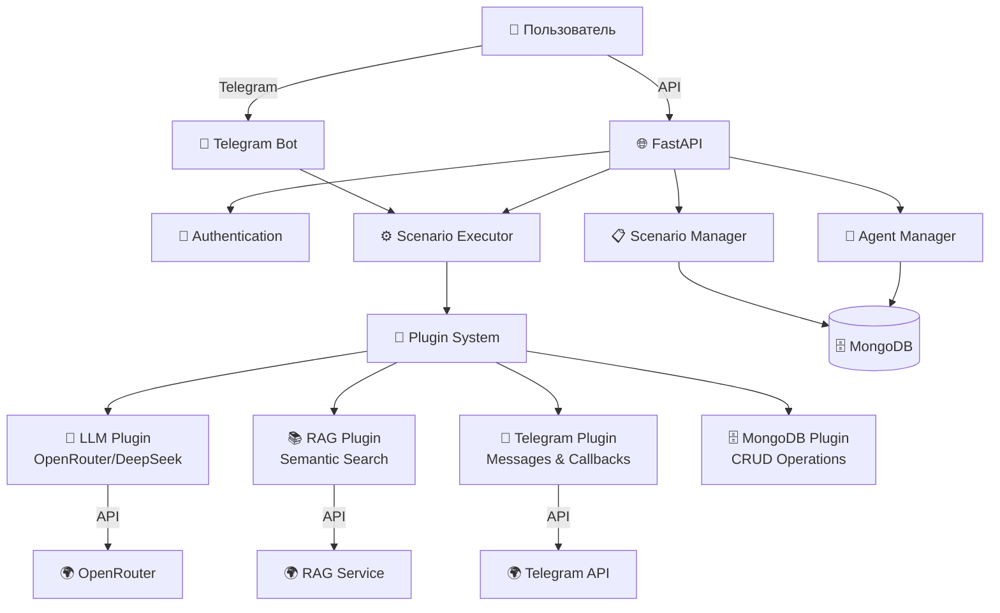

# Universal Agent Platform

**Универсальная платформа для создания, управления и запуска ИИ-агентов с поддержкой различных интеграций и каналов взаимодействия.**

## 🚀 Быстрый старт

### 1. Клонирование репозитория
   ```bash
git clone https://github.com/yourusername/universal-agent-platform.git
   cd universal_agent_system
   ```

### 2. Настройка переменных окружения
   ```bash
   cp .env.example .env
# Отредактируйте .env файл с вашими настройками
   ```

### 3. Запуск с Docker
   ```bash
   docker-compose up -d
   ```

### 4. Проверка работоспособности
   ```bash
# API
   curl http://localhost:8000/health

# Swagger документация
open http://localhost:8000/docs
   
   # Проверка Telegram-бота
curl http://localhost:8000/api/v1/integration/telegram/health
   
   # Проверка RAG-интеграции
curl -X POST "http://localhost:8000/api/v1/integration/rag/query" \
  -H "Content-Type: application/json" \
  -d '{"query": "что такое искусственный интеллект", "top_k": 3}'
```

## 📋 Доступные сервисы

После запуска доступны:
- **API**: http://localhost:8000
- **Swagger UI**: http://localhost:8000/docs  
- **MongoDB**: localhost:27017
- **Redis**: localhost:6380
- **Telegram-бот**: автоматически запущен

## 🏗️ Архитектура системы



## 🧩 Компоненты системы

### Core Components
- **Agent Manager**: Создание и управление ИИ-агентами
- **Scenario Manager**: Управление сценариями взаимодействия
- **Scenario Executor**: Выполнение сценариев с поддержкой state machine
- **Plugin System**: Расширяемая система плагинов

### Plugins
- **LLM Plugin**: Интеграция с языковыми моделями (OpenRouter, DeepSeek)
- **RAG Plugin**: Семантический поиск по базе знаний
- **Telegram Plugin**: Отправка сообщений, обработка callback'ов, inline кнопки
- **MongoDB Plugin**: CRUD операции с базой данных

### Databases
- **MongoDB**: Основная база данных для агентов, сценариев, пользователей
- **Redis**: Кэширование и временные данные

## 📁 Структура проекта

```
universal_agent_system/
├── app/                           # Основное приложение
│   ├── api/                       # API endpoints
│   │   ├── agent_actions.py       # Запуск агентов
│   │   ├── agents.py              # CRUD агентов
│   │   ├── integration.py         # Интеграционные endpoints
│   │   ├── runner.py              # Выполнение сценариев
│   │   ├── scenarios.py           # CRUD сценариев
│   │   └── users.py               # CRUD пользователей
│   ├── core/                      # Ядро системы
│   │   ├── dependencies.py        # DI и инициализация
│   │   ├── scenario_executor.py   # Исполнитель сценариев
│   │   ├── state_machine.py       # State machine логика
│   │   └── utils.py               # Утилиты
│   ├── db/                        # База данных
│   │   ├── mongodb.py             # MongoDB подключение
│   │   └── repositories/          # Репозитории
│   ├── models/                    # Pydantic модели
│   ├── plugins/                   # Система плагинов
│   │   ├── plugin_base.py         # Базовый класс плагина
│   │   ├── llm_plugin.py          # LLM интеграция
│   │   ├── rag_plugin.py          # RAG интеграция
│   │   ├── telegram_plugin.py     # Telegram интеграция
│   │   └── mongo_storage_plugin.py # MongoDB интеграция
│   └── main.py                    # Точка входа
├── docs/                          # Документация
├── scenarios/                     # JSON сценарии
│   └── unit_tests/                # Тестовые сценарии
├── tests/                         # Unit тесты
├── frontend/                      # React фронтенд (опционально)
├── docker-compose.yml             # Docker конфигурация
└── requirements.txt               # Python зависимости
```

## 📊 API Endpoints

### Основные ресурсы
```bash
# Пользователи
GET    /api/v1/users/              # Список пользователей
POST   /api/v1/users/              # Создать пользователя
GET    /api/v1/users/{id}          # Получить пользователя
PATCH  /api/v1/users/{id}          # Обновить пользователя
DELETE /api/v1/users/{id}          # Удалить пользователя

# Агенты
GET    /api/v1/agents/             # Список агентов
POST   /api/v1/agents/             # Создать агента
GET    /api/v1/agents/{id}         # Получить агента
PATCH  /api/v1/agents/{id}         # Обновить агента
DELETE /api/v1/agents/{id}         # Удалить агента

# Сценарии
GET    /api/v1/scenarios/          # Список сценариев
POST   /api/v1/scenarios/          # Создать сценарий
GET    /api/v1/scenarios/{id}      # Получить сценарий
PATCH  /api/v1/scenarios/{id}      # Обновить сценарий
DELETE /api/v1/scenarios/{id}      # Удалить сценарий

# Выполнение агентов
POST   /api/v1/agent-actions/{agent_id}/execute  # Запустить агента
```

### Интеграционные endpoints
```bash
# LLM интеграция
POST   /api/v1/integration/llm/query              # Запрос к LLM
GET    /api/v1/integration/llm/models             # Список моделей

# RAG интеграция  
POST   /api/v1/integration/rag/query              # Поиск в RAG
GET    /api/v1/integration/rag/health             # Healthcheck

# Telegram интеграция
POST   /api/v1/integration/telegram/send          # Отправить сообщение
GET    /api/v1/integration/telegram/health        # Healthcheck

# MongoDB интеграция
POST   /api/v1/integration/mongo/insert           # Вставить документ
POST   /api/v1/integration/mongo/find             # Найти документы
POST   /api/v1/integration/mongo/update           # Обновить документ
POST   /api/v1/integration/mongo/delete           # Удалить документ
```

## 🔌 Система плагинов

### Типы шагов сценариев

**Базовые шаги:**
- `start`, `end` - начало и завершение
- `message` - отправка сообщения
- `input` - запрос ввода от пользователя
- `branch` - условное ветвление
- `log` - логирование

**LLM Plugin:**
- `llm_request` - запрос к языковой модели

**RAG Plugin:**
- `rag_search` - семантический поиск

**Telegram Plugin:**
- `telegram_send_message` - отправка сообщения
- `telegram_edit_message` - редактирование сообщения

**MongoDB Plugin:**
- `mongo_insert_one` - вставка документа
- `mongo_find_one` - поиск документа
- `mongo_update_one` - обновление документа
- `mongo_delete_one` - удаление документа

## 🧪 Примеры использования

### Создание простого агента
```bash
curl -X POST "http://localhost:8000/api/v1/agents/" \
  -H "Content-Type: application/json" \
  -d '{
    "name": "Помощник",
    "scenario_id": "greeting_scenario",
    "plugins": ["LLMPlugin", "TelegramPlugin"],
    "initial_context": {"greeting": "Привет!"}
  }'
```

### Запуск сценария
```bash
curl -X POST "http://localhost:8000/api/v1/agent-actions/{agent_id}/execute" \
  -H "Content-Type: application/json" \
  -d '{}'
```

### LLM запрос
```bash
curl -X POST "http://localhost:8000/api/v1/integration/llm/query" \
  -H "Content-Type: application/json" \
  -d '{
    "prompt": "Объясни что такое ИИ",
    "model": "deepseek/deepseek-chat",
    "max_tokens": 100
  }'
```

### RAG поиск
```bash
curl -X POST "http://localhost:8000/api/v1/integration/rag/query" \
  -H "Content-Type: application/json" \
  -d '{
    "query": "машинное обучение",
    "top_k": 5
  }'
```

## ⚙️ Переменные окружения

Основные переменные в `.env`:
```bash
# MongoDB
MONGODB_URL=mongodb://localhost:27017
MONGODB_DB_NAME=universal_agent_db

# Redis
REDIS_URL=redis://localhost:6380

# Telegram
TELEGRAM_BOT_TOKEN=your_bot_token

# OpenRouter/LLM
OPENROUTER_API_KEY=your_openrouter_key

# RAG Service
RAG_URL=https://rag.cyberkitty.tech

# Логирование
LOG_LEVEL=INFO
```

## 📖 Документация

- [**Создание сценариев**](docs/scenario_development_guide.md) - Подробное руководство по созданию сценариев
- [**Формат сценариев**](docs/scenario_format.md) - Справочник по структуре JSON сценариев
- [**API документация**](docs/api_documentation.md) - Полная документация API
- [**Примеры сценариев**](docs/examples/) - Готовые примеры для начала работы

## 🧪 Тестирование

```bash
# Запуск unit тестов
docker-compose exec app python -m pytest tests/

# Тестирование через scenarios/unit_tests/
curl -X POST "http://localhost:8000/api/v1/scenarios/" \
  -H "Content-Type: application/json" \
  -d @scenarios/unit_tests/unit_test_llm_request.json
```

## 🔧 Разработка

### Добавление нового плагина
1. Создайте класс, наследующий от `PluginBase`
2. Реализуйте методы `register_step_handlers()` и `healthcheck()`
3. Добавьте плагин в `app/core/dependencies.py`
4. Зарегистрируйте типы шагов в `app/models/scenario.py`

### Структура плагина
```python
from app.plugins.plugin_base import PluginBase

class MyPlugin(PluginBase):
    def register_step_handlers(self, step_handlers):
        step_handlers["my_step"] = self.handle_my_step
    
    async def handle_my_step(self, step_data, context):
        # Логика обработки
        return None  # Всегда возвращать None
    
    async def healthcheck(self):
        return {"status": "healthy"}
```

## 🤝 Contributing

1. Fork проекта
2. Создайте feature ветку (`git checkout -b feature/amazing-feature`)
3. Commit изменения (`git commit -m 'Add amazing feature'`)
4. Push в ветку (`git push origin feature/amazing-feature`)
5. Откройте Pull Request

## 📄 Лицензия

Этот проект распространяется под MIT лицензией. См. `LICENSE` для деталей.

## 📞 Поддержка

- **Документация**: [docs/](docs/)
- **Issues**: [GitHub Issues](https://github.com/yourusername/universal-agent-platform/issues)
- **Discussions**: [GitHub Discussions](https://github.com/yourusername/universal-agent-platform/discussions) 