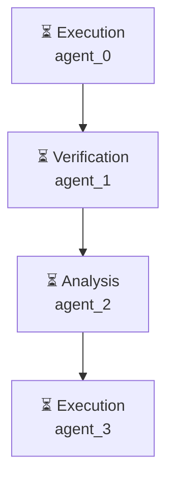

# Декомпозиция - 0fb79ce6

# Декомпозиция задачи

## Исходная задача
Создай файл hello.py с кодом print('Hello, World!')

## Анализ сложности
- **Сложность**: complex
- **Агентов**: 2

## Подзадачи (4)

### 1. Подзадача 1

**Описание**: Создать файл hello.py с кодом print('Hello, World!')

**Детали**:
- ID: `step1`
- Приоритет: средний
- Сложность: неизвестно
- Навыки: 
- Зависимости: нет

---

### 2. Подзадача 2

**Описание**: Дать правильный формат файлу hello.py для запуска как Python-скрипт

**Детали**:
- ID: `step2`
- Приоритет: средний
- Сложность: неизвестно
- Навыки: 
- Зависимости: нет

---

### 3. Подзадача 3

**Описание**: Использовать Python 3 в файле hello.py

**Детали**:
- ID: `step3`
- Приоритет: средний
- Сложность: неизвестно
- Навыки: 
- Зависимости: нет

---

### 4. Подзадача 4

**Описание**: Устранить любые ошибки при выполнении скрипта

**Детали**:
- ID: `step4`
- Приоритет: средний
- Сложность: неизвестно
- Навыки: 
- Зависимости: нет

---

## Граф выполнения

