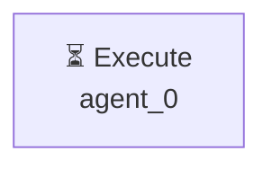

# Декомпозиция - 2c43f74a

# Декомпозиция задачи

## Исходная задача
Создай файл hello.py с кодом print('Hello, World!')

## Анализ сложности
- **Сложность**: simple
- **Агентов**: 1

## Подзадачи (1)

### 1. Подзадача 1

**Описание**: Создай файл hello.py с кодом print('Hello, World!')

**Детали**:
- ID: `single_task`
- Приоритет: средний
- Сложность: неизвестно
- Навыки: 
- Зависимости: нет

---

## Граф выполнения

