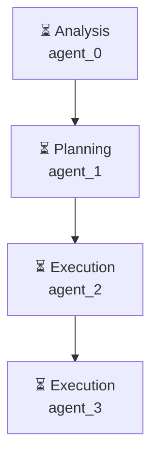

# Декомпозиция - 7f1d25f0

# Декомпозиция задачи

## Исходная задача
Создай файл hello.py с кодом print('Hello, World!')

## Анализ сложности
- **Сложность**: medium
- **Агентов**: 2

## Подзадачи (4)

### 1. Подзадача 1

**Описание**: Оценить требование к выводу 'Hello, World!'

**Детали**:
- ID: `step1`
- Приоритет: средний
- Сложность: неизвестно
- Навыки: 
- Зависимости: нет

---

### 2. Подзадача 2

**Описание**: Выбрать подходящий метод для вывода 'Hello, World!'

**Детали**:
- ID: `step2`
- Приоритет: средний
- Сложность: неизвестно
- Навыки: 
- Зависимости: нет

---

### 3. Подзадача 3

**Описание**: Создать файл 'hello.py' и ввести текст 'print('Hello, World!')'

**Детали**:
- ID: `step3`
- Приоритет: средний
- Сложность: неизвестно
- Навыки: 
- Зависимости: нет

---

### 4. Подзадача 4

**Описание**: Выполнить файл 'hello.py' и проверить результат

**Детали**:
- ID: `step4`
- Приоритет: средний
- Сложность: неизвестно
- Навыки: 
- Зависимости: нет

---

## Граф выполнения

