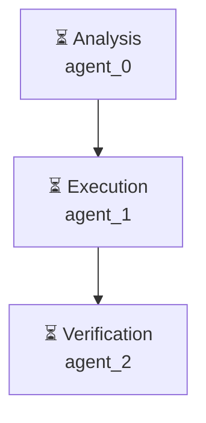

# Декомпозиция - d2aa7da7

# Декомпозиция задачи

## Исходная задача
Создай файл hello.py с кодом print('Hello, World!')

## Анализ сложности
- **Сложность**: medium
- **Агентов**: 2

## Подзадачи (3)

### 1. Подзадача 1

**Описание**: Анализ задачи: Создай файл hello.py с кодом print('Hello, World!')

**Детали**:
- ID: `analyze`
- Приоритет: средний
- Сложность: неизвестно
- Навыки: 
- Зависимости: нет

---

### 2. Подзадача 2

**Описание**: Выполнение: Создай файл hello.py с кодом print('Hello, World!')

**Детали**:
- ID: `execute`
- Приоритет: средний
- Сложность: неизвестно
- Навыки: 
- Зависимости: нет

---

### 3. Подзадача 3

**Описание**: Проверка результата: Создай файл hello.py с кодом print('Hello, World!')

**Детали**:
- ID: `verify`
- Приоритет: средний
- Сложность: неизвестно
- Навыки: 
- Зависимости: нет

---

## Граф выполнения

