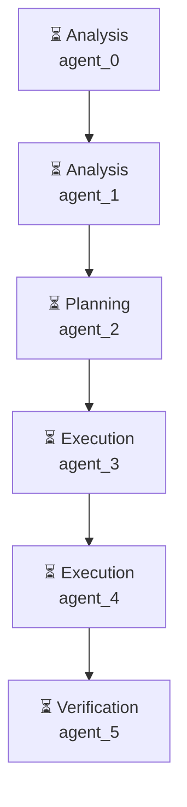

# Декомпозиция - 40765be1

# Декомпозиция задачи

## Исходная задача
Проведи анализ рынка приложений маркета битрикс 24, найди топ 5 популярных, составь отчёт о проблемах и сделай 2 прототипа приложений

## Анализ сложности
- **Сложность**: medium
- **Агентов**: 3

## Подзадачи (6)

### 1. Подзадача 1

**Описание**: Исследовать рынок приложений маркета битрикс 24

**Детали**:
- ID: `step1.1`
- Приоритет: средний
- Сложность: неизвестно
- Навыки: 
- Зависимости: нет

---

### 2. Подзадача 2

**Описание**: Найдите топ 5 популярных приложений маркета битрикс 24

**Детали**:
- ID: `step1.2`
- Приоритет: средний
- Сложность: неизвестно
- Навыки: 
- Зависимости: нет

---

### 3. Подзадача 3

**Описание**: Составить отчёт о проблемах и ограничениях приложений

**Детали**:
- ID: `step2.1`
- Приоритет: средний
- Сложность: неизвестно
- Навыки: 
- Зависимости: нет

---

### 4. Подзадача 4

**Описание**: Создать прототип приложения 1

**Детали**:
- ID: `step3.1`
- Приоритет: средний
- Сложность: неизвестно
- Навыки: 
- Зависимости: нет

---

### 5. Подзадача 5

**Описание**: Создать прототип приложения 2

**Детали**:
- ID: `step3.2`
- Приоритет: средний
- Сложность: неизвестно
- Навыки: 
- Зависимости: нет

---

### 6. Подзадача 6

**Описание**: Тестировать и проверять результаты приложений

**Детали**:
- ID: `step4.1`
- Приоритет: средний
- Сложность: неизвестно
- Навыки: 
- Зависимости: нет

---

## Граф выполнения

