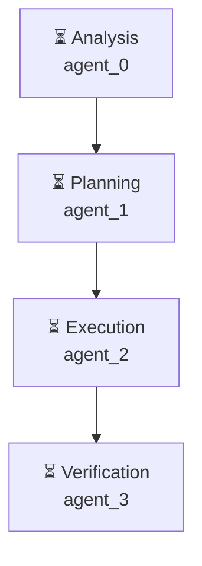

# Декомпозиция - 431d5fc8

# Декомпозиция задачи

## Исходная задача
Проведи анализ рынка приложений маркета битрикс 24, найди топ популярных, составь отчёт о том, какие там есть, насколько они сложны в реализации и какие проблемы имеют. После сделай 3 прототипа приложений на основе этого анализа - которые можно сделать быстро с улучшением UX

## Анализ сложности
- **Сложность**: complex
- **Агентов**: 4

## Подзадачи (4)

### 1. Подзадача 1

**Описание**: Анализ задачи: Проведи анализ рынка приложений маркета битрикс 24, найди топ популярных, составь отчёт о том, какие там есть, насколько они сложны в реализации и какие проблемы имеют. После сделай 3 прототипа приложений на основе этого анализа - которые можно сделать быстро с улучшением UX

**Детали**:
- ID: `analyze`
- Приоритет: средний
- Сложность: неизвестно
- Навыки: 
- Зависимости: нет

---

### 2. Подзадача 2

**Описание**: Планирование решения: Проведи анализ рынка приложений маркета битрикс 24, найди топ популярных, составь отчёт о том, какие там есть, насколько они сложны в реализации и какие проблемы имеют. После сделай 3 прототипа приложений на основе этого анализа - которые можно сделать быстро с улучшением UX

**Детали**:
- ID: `plan`
- Приоритет: средний
- Сложность: неизвестно
- Навыки: 
- Зависимости: нет

---

### 3. Подзадача 3

**Описание**: Выполнение: Проведи анализ рынка приложений маркета битрикс 24, найди топ популярных, составь отчёт о том, какие там есть, насколько они сложны в реализации и какие проблемы имеют. После сделай 3 прототипа приложений на основе этого анализа - которые можно сделать быстро с улучшением UX

**Детали**:
- ID: `execute`
- Приоритет: средний
- Сложность: неизвестно
- Навыки: 
- Зависимости: нет

---

### 4. Подзадача 4

**Описание**: Проверка результата: Проведи анализ рынка приложений маркета битрикс 24, найди топ популярных, составь отчёт о том, какие там есть, насколько они сложны в реализации и какие проблемы имеют. После сделай 3 прототипа приложений на основе этого анализа - которые можно сделать быстро с улучшением UX

**Детали**:
- ID: `verify`
- Приоритет: средний
- Сложность: неизвестно
- Навыки: 
- Зависимости: нет

---

## Граф выполнения

