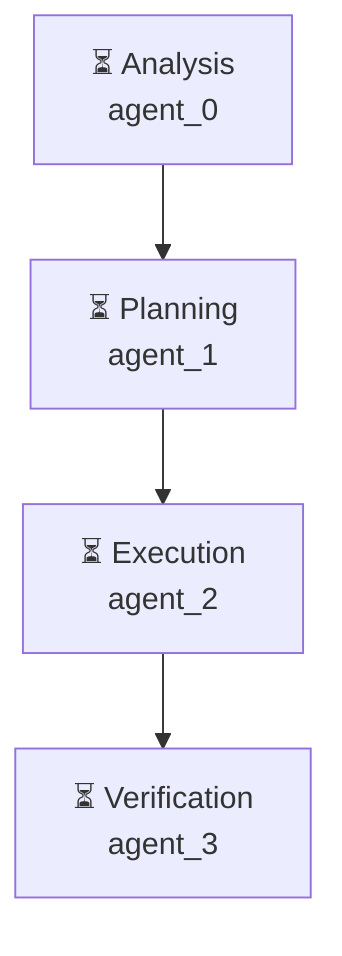

# Декомпозиция - 5dc001aa

# Декомпозиция задачи

## Исходная задача
Проведи анализ рынка приложений маркета битрикс 24, найди топ популярных, составь отчёт о том, какие там есть, насколько они сложны в реализации и какие проблемы имеют. После сделай 3 прототипа приложений на основе этого анализа - которые можно сделать быстро с улучшением UX

## Анализ сложности
- **Сложность**: complex
- **Агентов**: 4

## Подзадачи (4)

### 1. Подзадача 1

**Описание**: Анализ рынка приложений маркета битрикс 24: выявление топ-приложений, их сложности в реализации и выявление проблем

**Детали**:
- ID: `step1-analyze-market`
- Приоритет: средний
- Сложность: неизвестно
- Навыки: 
- Зависимости: нет

---

### 2. Подзадача 2

**Описание**: Планирование создания приложений на основе анализа рынка. Выбор методов, подходящих для каждой сложности приложений

**Детали**:
- ID: `step2-plan-applications`
- Приоритет: средний
- Сложность: неизвестно
- Навыки: 
- Зависимости: нет

---

### 3. Подзадача 3

**Описание**: Создание 3-4 прототипов приложений на основе плана. Улучшение UX для каждого прототипа

**Детали**:
- ID: `step3-create-prootypes`
- Приоритет: средний
- Сложность: неизвестно
- Навыки: 
- Зависимости: нет

---

### 4. Подзадача 4

**Описание**: Тестирование и проверка результатов 3-4 прототипов. Определение проблем и улучшений

**Детали**:
- ID: `step4-test-prootypes`
- Приоритет: средний
- Сложность: неизвестно
- Навыки: 
- Зависимости: нет

---

## Граф выполнения

