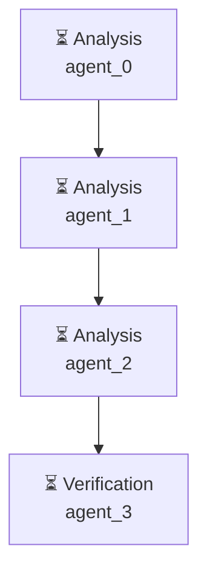

# Декомпозиция - 82cf08b6

# Декомпозиция задачи

## Исходная задача
Проведи анализ рынка приложений маркета битрикс 24, найди топ 3 популярных

## Анализ сложности
- **Сложность**: complex
- **Агентов**: 2

## Подзадачи (4)

### 1. Подзадача 1

**Описание**: Исследовать рынок Bitrix24, определить popularnost' приложений

**Детали**:
- ID: `step1`
- Приоритет: средний
- Сложность: неизвестно
- Навыки: 
- Зависимости: нет

---

### 2. Подзадача 2

**Описание**: Собрать данные о popularnosti' приложений из Bitrix24 Marketplace

**Детали**:
- ID: `step2`
- Приоритет: средний
- Сложность: неизвестно
- Навыки: 
- Зависимости: нет

---

### 3. Подзадача 3

**Описание**: Оценить popularnost' приложений и определить топ 3

**Детали**:
- ID: `step3`
- Приоритет: средний
- Сложность: неизвестно
- Навыки: 
- Зависимости: нет

---

### 4. Подзадача 4

**Описание**: Провести проверку результатов и подтвердить топ 3

**Детали**:
- ID: `step4`
- Приоритет: средний
- Сложность: неизвестно
- Навыки: 
- Зависимости: нет

---

## Граф выполнения

