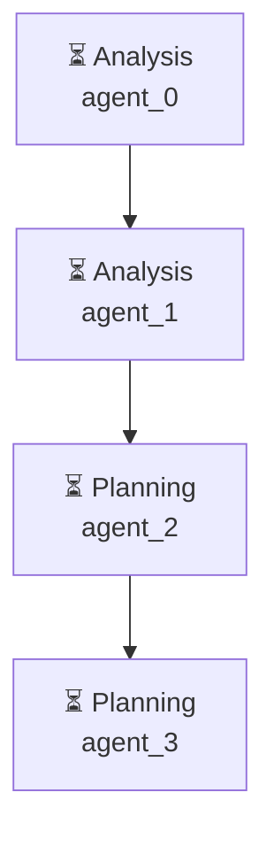

# Декомпозиция - c100be5d

# Декомпозиция задачи

## Исходная задача
Проведи анализ рынка приложений маркета битрикс 24, найди топ популярных

## Анализ сложности
- **Сложность**: medium
- **Агентов**: 3

## Подзадачи (4)

### 1. Подзадача 1

**Описание**: Анализ требований к приложению маркета битрикс 24

**Детали**:
- ID: `step1`
- Приоритет: средний
- Сложность: неизвестно
- Навыки: 
- Зависимости: нет

---

### 2. Подзадача 2

**Описание**: Исследование рынка приложений маркета битрикс 24

**Детали**:
- ID: `step2`
- Приоритет: средний
- Сложность: неизвестно
- Навыки: 
- Зависимости: нет

---

### 3. Подзадача 3

**Описание**: Определение приоритета приложений на рынке

**Детали**:
- ID: `step3`
- Приоритет: средний
- Сложность: неизвестно
- Навыки: 
- Зависимости: нет

---

### 4. Подзадача 4

**Описание**: Разработка стратегии создания приложения

**Детали**:
- ID: `step4`
- Приоритет: средний
- Сложность: неизвестно
- Навыки: 
- Зависимости: нет

---

## Граф выполнения

