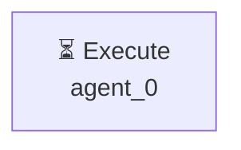

# Декомпозиция - fb3d8e89

# Декомпозиция задачи

## Исходная задача
Проведи анализ рынка приложений маркета битрикс 24, найди топ популярных, составь отчёт о том, какие там есть, насколько они сложны в реализации и какие проблемы имеют. После сделай 3 прототипа приложений на основе этого анализа - которые можно сделать быстро с улучшением UX

## Анализ сложности
- **Сложность**: simple
- **Агентов**: 1

## Подзадачи (1)

### 1. Подзадача 1

**Описание**: Проведи анализ рынка приложений маркета битрикс 24, найди топ популярных, составь отчёт о том, какие там есть, насколько они сложны в реализации и какие проблемы имеют. После сделай 3 прототипа приложений на основе этого анализа - которые можно сделать быстро с улучшением UX

**Детали**:
- ID: `single_task`
- Приоритет: средний
- Сложность: неизвестно
- Навыки: 
- Зависимости: нет

---

## Граф выполнения

