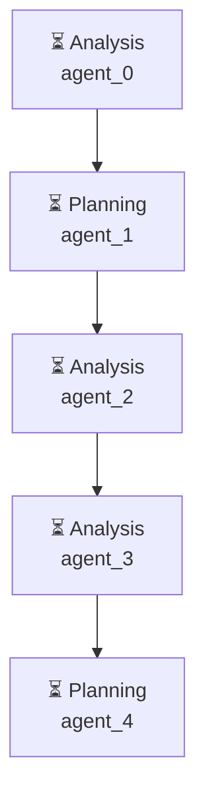

# Декомпозиция - a34718cc

# Декомпозиция задачи

## Исходная задача

    Проведи анализ рынка Битрикс24:
    1. Найди ТОП-10 популярных приложений в Битрикс24 маркетплейсе
    2. Создай подробный отчёт что существует на рынке
    3. Проанализируй сложность реализации каждого типа приложений
    4. Выяви основные проблемы существующих решений
    5. Создай 3 прототипа улучшенных UX приложений с конкретными решениями
    

## Анализ сложности
- **Сложность**: complex
- **Агентов**: 4

## Подзадачи (5)

### 1. Подзадача 1

**Описание**: Найди ТОП-10 популярных приложений в Битрикс24 маркетплейсе

**Детали**:
- ID: `step1`
- Приоритет: средний
- Сложность: неизвестно
- Навыки: 
- Зависимости: нет

---

### 2. Подзадача 2

**Описание**: Создай подробный отчёт, в котором будет описано, что существует на рынке

**Детали**:
- ID: `step2`
- Приоритет: средний
- Сложность: неизвестно
- Навыки: 
- Зависимости: нет

---

### 3. Подзадача 3

**Описание**: Проанализируй сложность реализации каждого типа приложений

**Детали**:
- ID: `step3`
- Приоритет: средний
- Сложность: неизвестно
- Навыки: 
- Зависимости: нет

---

### 4. Подзадача 4

**Описание**: Выяви основные проблемы существующих решений

**Детали**:
- ID: `step4`
- Приоритет: средний
- Сложность: неизвестно
- Навыки: 
- Зависимости: нет

---

### 5. Подзадача 5

**Описание**: Создай 3 прототипа улучшенных UX приложений с конкретными решениями

**Детали**:
- ID: `step5`
- Приоритет: средний
- Сложность: неизвестно
- Навыки: 
- Зависимости: нет

---

## Граф выполнения

