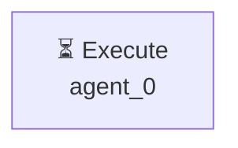

# Декомпозиция - 10a0d1d6

# Декомпозиция задачи

## Исходная задача
Проведи анализ популярных CRM систем и создай отчёт с 3 рекомендациями

## Анализ сложности
- **Сложность**: simple
- **Агентов**: 1

## Подзадачи (1)

### 1. Подзадача 1

**Описание**: Проведи анализ популярных CRM систем и создай отчёт с 3 рекомендациями

**Детали**:
- ID: `single_task`
- Приоритет: средний
- Сложность: неизвестно
- Навыки: 
- Зависимости: нет

---

## Граф выполнения

